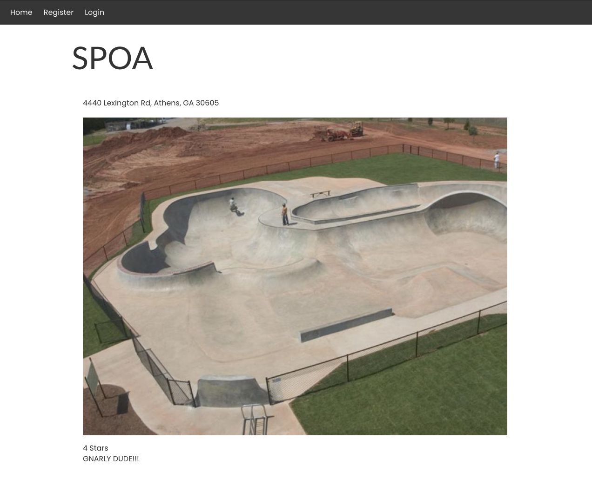

<!-- markdownlint-disable no-trailing-punctuation no-inline-html -->
# Skatepark Review App: BUSTED!!!

My Skatepark Review App is BUSTED!!!

I'll share a `.env` file with the class via Slack. This has the proper connection information for a database hosted on ElephantSQL.

## Requirements

There are ~15 or so bugs in this file (I think?).

* Fork this repo, and clone it to your machine.
* Run `npm i` to install all the dependencies in `package.json`
 (_I promise there are no errors in the dependencies_!)
* Look at the `scripts` section to determine what scripts you can run.
* Try to run the app.
* **Find and fix the errors!**

## These files are in play

* `app.js` is in play!
* `conn.js` is in play!
* All routes, views, and models are in play!
* `package.json` is in play!

## These files are fine

* The dependencies are correct (but other parts of `package.json` might not be!).
* `package-lock.json` is fine.
* The `schema` and `seed` files are accurate.
* The `.env` file is fine.
* The database is correct, as well as the username and password.
* The "Leave a Review" form has been removed from this example
* You don't need any _new_ files.
* You don't need to rename any files.
* Fix the bugs in the _existing files only_!

## The working app should look like the following screenshot (single park view):

